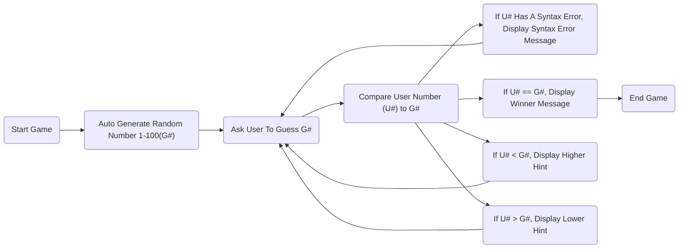

Node "**Start**" is just the start of the game.

**1** generates a random number between 1 and 100.

**2** asks the user to guess the generated number.

On **3**, the game compares the user's guess to its generated number.

**4** brings the user back to **2** if there is a syntax error in their guess.

If not, then **5.1** displays a winning message if the computer reads that the user's guess is correct.

If it is *less* than the generated number, **5.2** will bring the user back to **2** where they will have to guess again.

If it is *greater* than the generated number, **5.2** will bring the user back to **2** where they will have to guess again.

Once the correct guess is found, node "**End**" ends the game.
